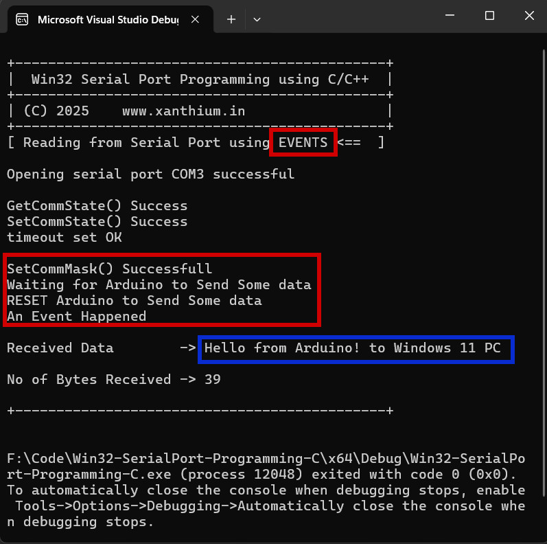

# Windows Serial Port Programming Tutorial using C/C++ and Win32 API

- Introduction to Serial Port Programming using Win32 API for Communicating with external devices like Raspberry Pi Pico or Arduino.
- This project demonstrates how to perform **serial port communication** between a **Windows PC** and an **embedded system (like an ATmega microcontroller)** using the **native Win32/Win64 API** in C. 
- The program does **not require any external libraries** such as MFC or .NET, and can be compiled using **Visual Studio**.
- Designed for an Software Developer who wants to dabble in Windows System Programming 

## Online Tutorial 

- [Serial Port Communication between Windows OS and Arduino Board using C/C++ and Win32 API Tutorial](https://www.xanthium.in/serial-port-communication-with-microcontroller-programming-using-win32-win64-native-api)

## Screenshots of Win32 Serial port Code in Action

-

## Major Features of Win32 COM port tutorial

- Direct access to COM ports using the Win32 API and C language
- Send and receive data over serial port (e.g., COM1) 
- Compatible with both 32-bit and 64-bit Windows OS (Windows 7,Windows 8,Windows 10,Windows 11)
- Useful for communication with microcontrollers, Arduino, sensors, etc.

## Prerequisites

- Windows (Win10/11 32/64-bit)
- Visual Studio 2017/2019/2022
- Basic knowledge of **C** and serial communication
- Arduino or other Microcontroller Board 

## Hardware Setup for Serial Port Communication with Microcontroller using Win32 API

You will need:
- A USB-to-Serial converter or real serial port (e.g., COM1)
- A microcontroller or loopback device for testing
- (Optional) Virtual Serial Port Emulator if no hardware is available

## Code Overview

