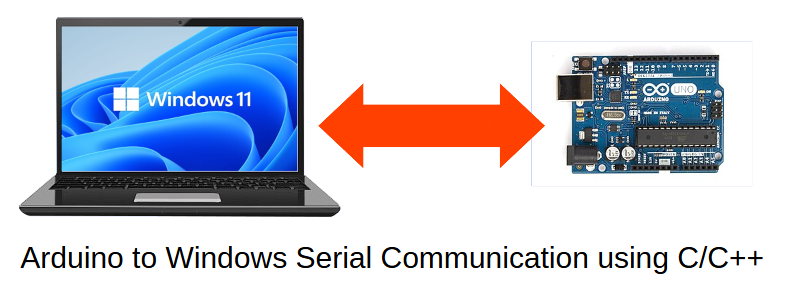

# Windows Serial Port Programming Tutorial using C/C++ and Win32 API
Introduction to Serial Port Programming using Win32 API for Communicating with external devices like Raspberry Pi Pico or Arduino 

## Online Tutorial 

- [Serial Port Communication between Windows OS and Arduino Board using C/C++ and Win32 API Tutorial](https://www.xanthium.in/serial-port-communication-with-microcontroller-programming-using-win32-win64-native-api)
